# Sistema de monitoreo y alertas en AWS

## 📋 Descripción del proyecto
Implementación de un sistema completo de supervisión y alertas en AWS para detectar y notificar eventos de seguridad en tiempo real, basado en un escenario de protección de infraestructura cloud.

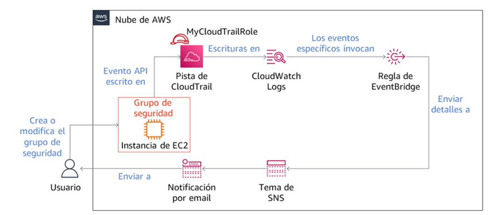

## 🏗️ Componentes de la arquitectura
| Servicio | Función |
|----------|---------|
| **CloudTrail** | Auditoría de todas las llamadas API |
| **SNS** | Notificaciones por correo electrónico |
| **EventBridge** | Detección de cambios en grupos de seguridad |
| **CloudWatch** | Alarmas por intentos fallidos de login |
| **EC2** | Recurso monitoreado (instancia con grupo de seguridad)|

---

## 1. Configuración de CloudTrail con integración a CloudWatch Logs

### Objetivo
Establecer un registro de auditoría continua de las llamadas API en la cuenta AWS, habilitando su envío a CloudWatch Logs para su posterior análisis y monitoreo.

### 1.1 Análisis del historial de eventos
Exploramos el historial de eventos de CloudTrail para comprender la información que registra por defecto:

1. Accedimos a **CloudTrail** → **Historial de eventos**
2. Filtramos por **Origen del evento** = `cloudformation.amazonaws.com`
3. Seleccionamos el evento **CreateStack** más reciente

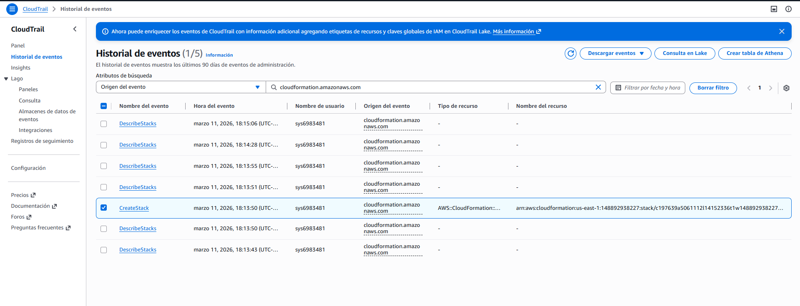

**Hallazgos importantes:**
- El evento `CreateStack` corresponde a la creación inicial de la infraestructura
- El registro incluye:
  - 👤 **userIdentity**: Usuario que ejecutó la acción
  - ⏰ **eventTime**: Marca de tiempo de la operación
  - 🌍 **awsRegion**: Región donde se desplegaron los recursos
  - 📋 **requestParameters**: Configuración específica de los recursos creados

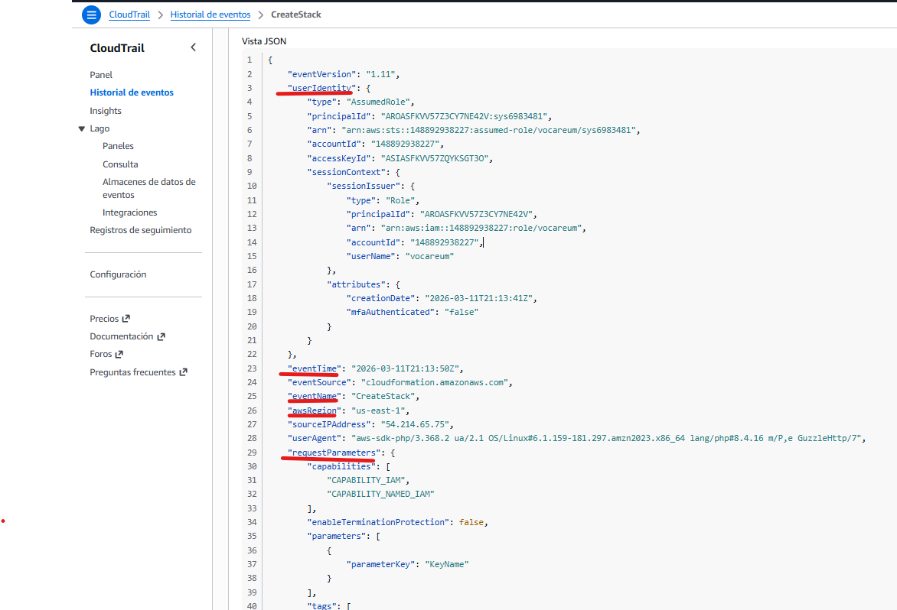

### Conclusión
El historial de eventos de CloudTrail proporciona visibilidad inmediata de las acciones recientes en la cuenta, permitiendo auditar quién, cuándo y qué recursos se crearon o modificaron en la infraestructura.

---

## 2. Implementación de sistema de notificaciones con SNS

### Objetivo
Implementar un mecanismo de alertas mediante Amazon SNS que permita notificar por correo electrónico cuando ocurran eventos de seguridad en la infraestructura.

### 2.1 Creación del topic SNS

1. Accedimos a la consola de **Amazon SNS** → **Topics**
2. Configuramos un nuevo topic:
   - **Tipo**: Estándar
   - **Nombre**: `MySNSTopic`
   - **Política de acceso**: Configurada para permitir publicaciones y suscripciones desde los servicios de monitoreo

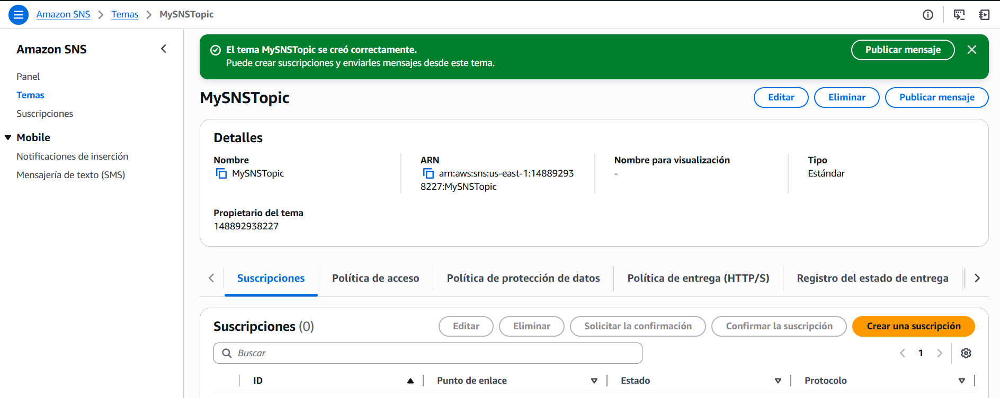

### 2.2 Configuración de suscripción por correo

1. Una vez creado el topic, procedimos a crear una suscripción
2. Configuramos:
   - **Protocolo**: Correo electrónico
   - **Endpoint**: `xxxxxxxbgjemain@gmail.com`

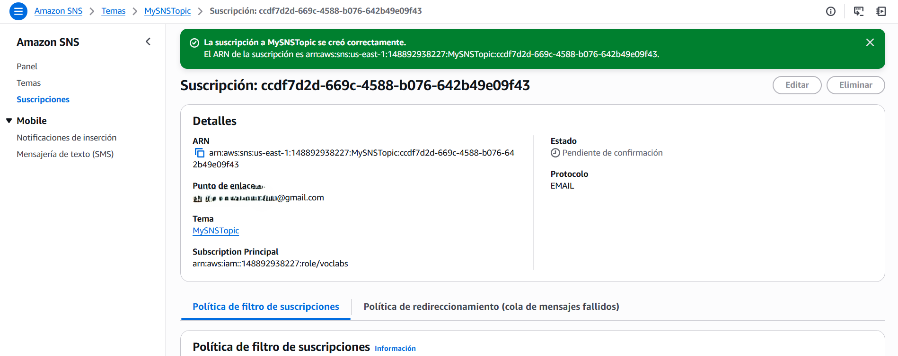

### 2.3 Confirmación de la suscripción

1. Recibimos un correo de **AWS Notifications** en la bandeja de entrada
2. Hicimos clic en el enlace de confirmación

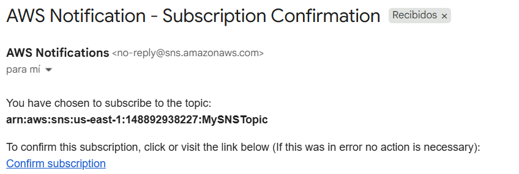

3. La página web confirmó la suscripción exitosamente

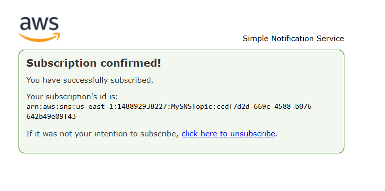

### 2.4 Verificación del estado
En la consola de SNS, verificamos que la suscripción aparecía con estado **Confirmado**, indicando que el endpoint está listo para recibir notificaciones.

### Conclusión
El sistema de notificaciones quedó correctamente implementado con un topic SNS y una suscripción por correo confirmada. Este mecanismo será el canal de comunicación para las alertas generadas por EventBridge y CloudWatch en las siguientes etapas del proyecto.

---

## 3. Implementación de regla de EventBridge para monitoreo de grupos de seguridad

### Objetivo
Configurar una regla en Amazon EventBridge que detecte modificaciones en los grupos de seguridad de EC2 y publique notificaciones en el topic SNS previamente creado.

### 3.1 Creación de la regla de monitoreo

1. Accedimos a la consola de **Amazon EventBridge** → **Reglas**
2. Configuramos una nueva regla con los siguientes parámetros:
   - **Nombre**: `MonitorSecurityGroups`
   - **Bus de eventos**: `default`
   - **Tipo de regla**: Regla con patrón de eventos


## 3.2 Definición del patrón de eventos

Utilizamos el editor JSON para definir el patrón que detectará modificaciones en grupos de seguridad:

```json
{
  "source": ["aws.ec2"],
  "detail-type": ["AWS API Call via CloudTrail"],
  "detail": {
    "eventSource": ["ec2.amazonaws.com"],
    "eventName": ["AuthorizeSecurityGroupIngress", "ModifyNetworkInterfaceAttribute"]
  }
}
```

### 3.3 Configuración del destino SNS
Se configuró como destino el topic `MySNSTopic` para recibir las notificaciones, incluyendo un transformador de entrada para personalizar el mensaje.

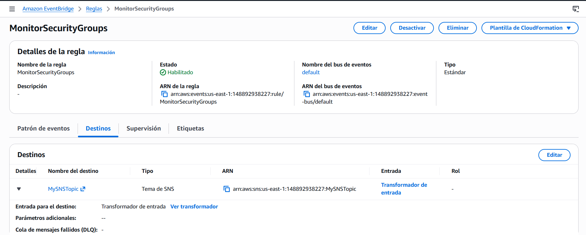

### 3.4 Prueba de la regla: modificación del grupo de seguridad
Para probar la regla, agregamos una regla de entrada HTTP (puerto 80) al grupo de seguridad asociado a la instancia EC2.

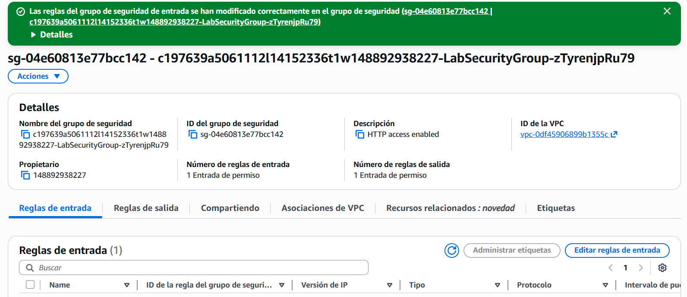

### 3.5 Verificación en CloudTrail
El evento `AuthorizeSecurityGroupIngress` quedó registrado en CloudTrail, confirmando que la acción fue capturada.

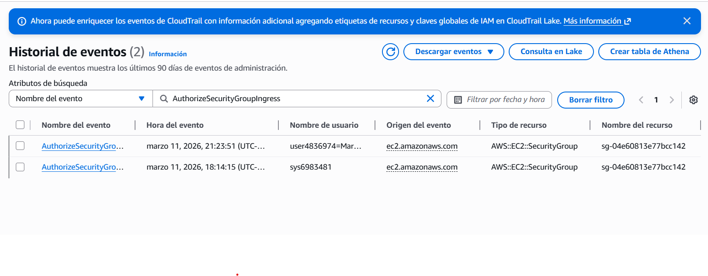

### 3.6 Detalle del evento
El detalle del evento muestra que se agregó una regla para el puerto 80, coincidiendo con la modificación realizada.

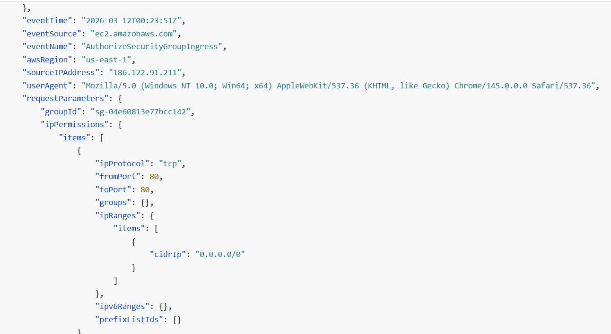

### 3.7 Notificación por correo
Minutos después de la modificación, recibimos un correo de AWS Notifications con los detalles del evento, confirmando que la regla publicó correctamente en el topic SNS.

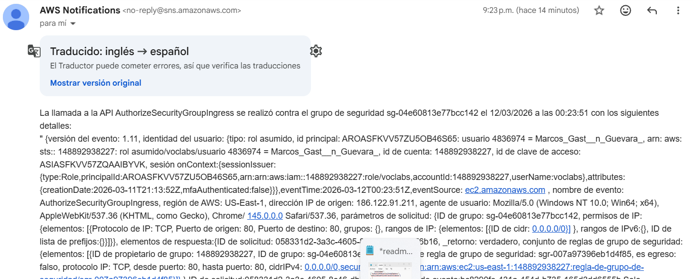

### Conclusión
La regla de EventBridge quedó correctamente implementada y validada. Cada modificación a los grupos de seguridad (agregar reglas de entrada o modificar interfaces de red) genera una notificación inmediata por correo electrónico, permitiendo una supervisión efectiva de cambios en la infraestructura de seguridad.


## 4. Implementación de alarma de CloudWatch para intentos fallidos de login

### Objetivo
Configurar una alarma en CloudWatch que detecte múltiples intentos fallidos de inicio de sesión en la consola de AWS y notifique por correo electrónico.

### 4.1 Creación del filtro de métricas
Se creó un filtro de métricas sobre el grupo de logs de CloudTrail para detectar eventos de login fallidos:

- **Patrón de filtro**: `{ ($.eventName = ConsoleLogin) && ($.errorMessage = "Failed authentication") }`
- **Nombre del filtro**: `ConsoleLoginErrors`
- **Espacio de nombres**: `CloudTrailMetrics`
- **Nombre de métrica**: `ConsoleLoginFailureCount`
- **Valor de métrica**: `1`


### 4.2 Creación de la alarma
Se configuró una alarma que se activa cuando hay 3 o más intentos fallidos en 5 minutos:

- **Nombre**: `FailedLogins`
- **Condición**: `ConsoleLoginFailureCount >= 3` en 5 minutos
- **Acción**: Notificación al topic SNS `MySNSTopic`

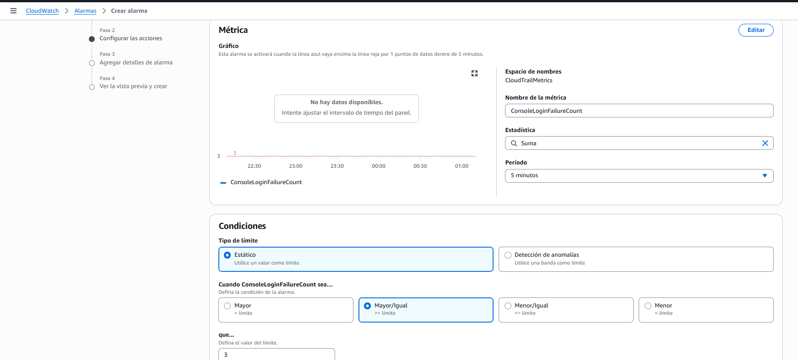
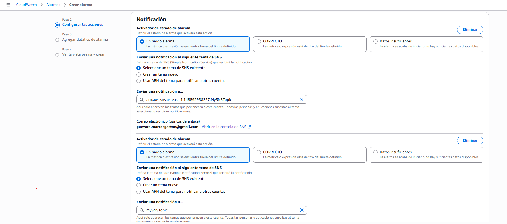
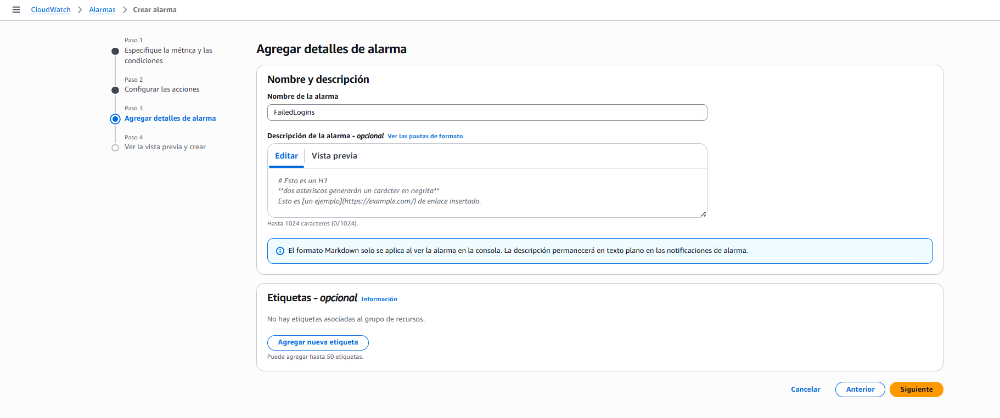

### 4.3 Alarma creada
La alarma se creó exitosamente en CloudWatch.

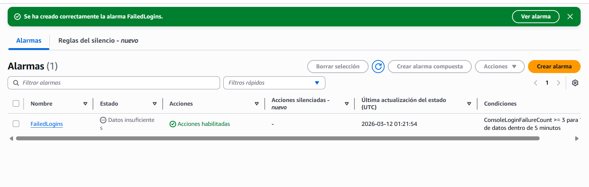

### 4.4 Prueba de la alarma
Se realizaron 3 intentos de inicio de sesión fallidos con el usuario `test`:

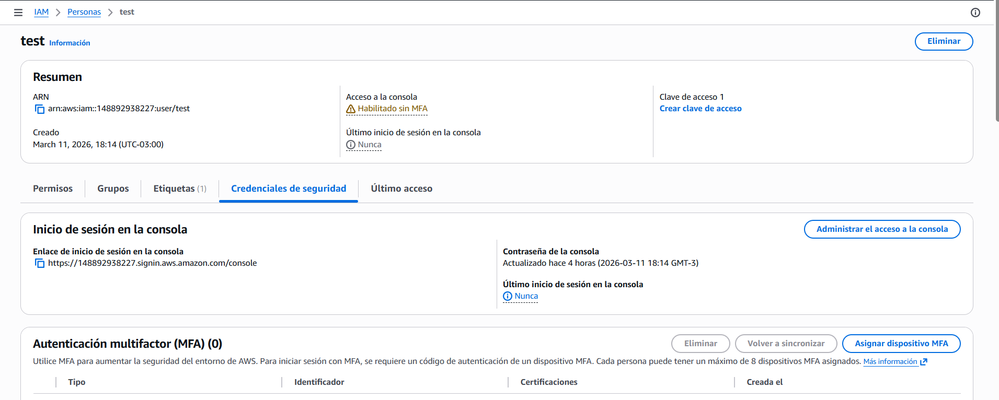
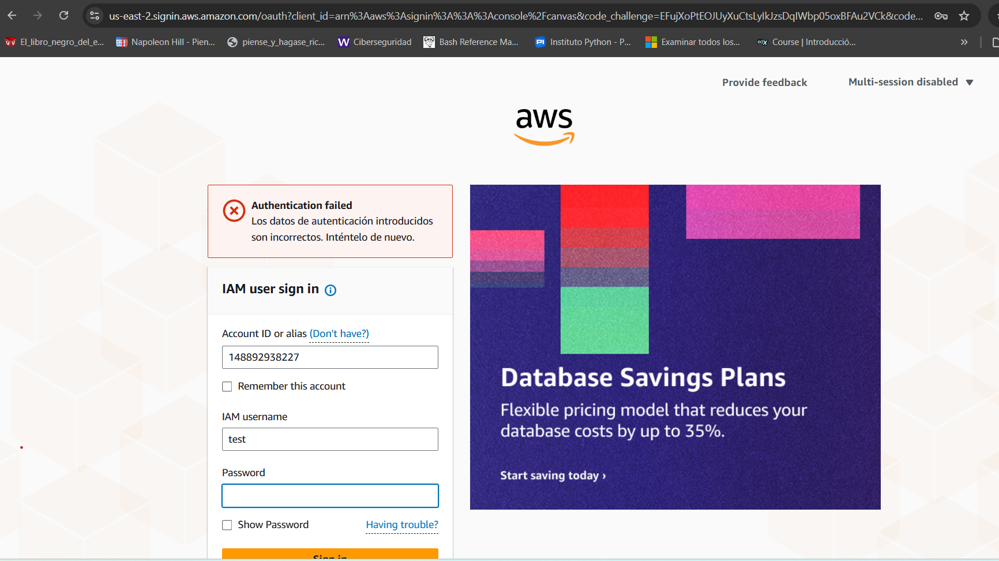

### 4.5 Verificación de la métrica
La métrica registró los intentos fallidos en CloudWatch.

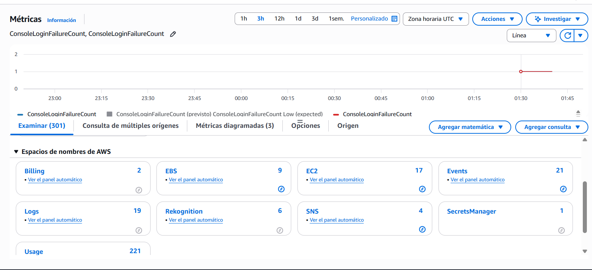

### 4.6 Estado de la alarma
La alarma cambió a estado **ALARMA** después de superar el umbral de 3 intentos fallidos.


### 4.7 Notificación por correo
Se recibió el correo de alerta confirmando la activación de la alarma.

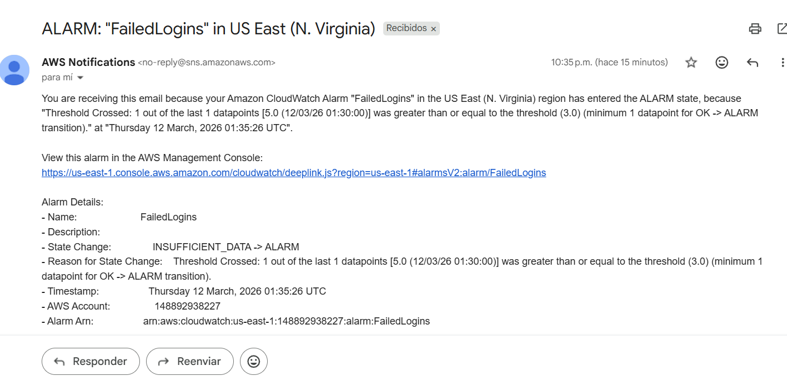

### Conclusión
La alarma de CloudWatch detecta correctamente intentos fallidos de login y notifica por correo, permitiendo responder ante posibles intentos de acceso no autorizados.

## 5. Consulta de registros de CloudTrail mediante CloudWatch Logs Insights

### Objetivo
Utilizar CloudWatch Logs Insights para consultar y analizar los registros de CloudTrail, específicamente los intentos fallidos de inicio de sesión en la consola de AWS.

### 5.1 Ejecución de la consulta

1. En la consola de **CloudWatch**, en el panel de navegación, seleccionamos **Información de registros** (Logs Insights).
2. En el menú desplegable **Seleccionar grupo de registros**, elegimos **`CloudTrailLogGroup`**.
3. Eliminamos el contenido existente del campo de consulta y pegamos el siguiente código:

```sql
filter eventSource="signin.amazonaws.com" and eventName="ConsoleLogin" and responseElements.ConsoleLogin="Failure"
| stats count(*) as Total_Count by sourceIPAddress as Source_IP, errorMessage as Reason, awsRegion as AWS_Region, userIdentity.arn as IAM_Arn

Hacemos clic en **Ejecutar consulta** (Run query).


### 5.2 Resultados obtenidos
La consulta devolvió los intentos fallidos de inicio de sesión registrados en CloudTrail, mostrando:

- **Source_IP**: Dirección IP desde donde se intentó acceder
- **Reason**: Motivo del fallo ("Failed authentication")
- **AWS_Region**: Región donde ocurrió el intento
- **IAM_Arn**: ARN del usuario que intentó acceder
- **Total_Count**: Número de intentos fallidos por combinación de factores


### 5.3 Análisis de los resultados
Los resultados confirmaron que:

- ✅ Se registraron múltiples intentos fallidos de login
- ✅ Todos corresponden al usuario `test`
- ✅ Las direcciones IP origen coinciden con las utilizadas en las pruebas
- ✅ El mensaje de error es consistente: `Failed authentication`

### Conclusión
CloudWatch Logs Insights permite consultar de forma rápida y eficiente los logs de CloudTrail, facilitando el análisis de eventos de seguridad como intentos fallidos de acceso. Esta herramienta es fundamental para investigaciones forenses y auditorías de seguridad en AWS.


